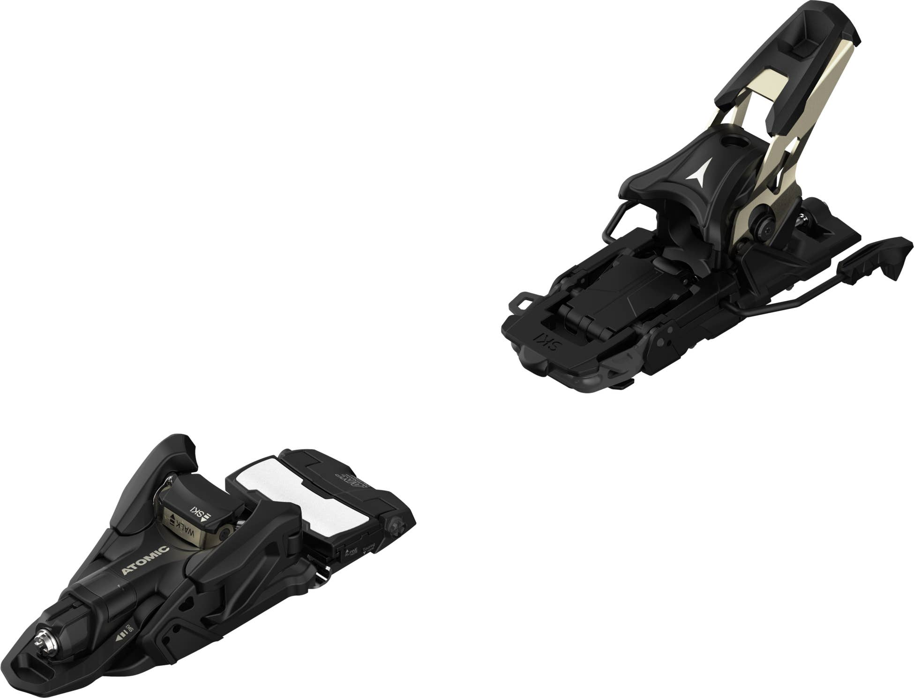
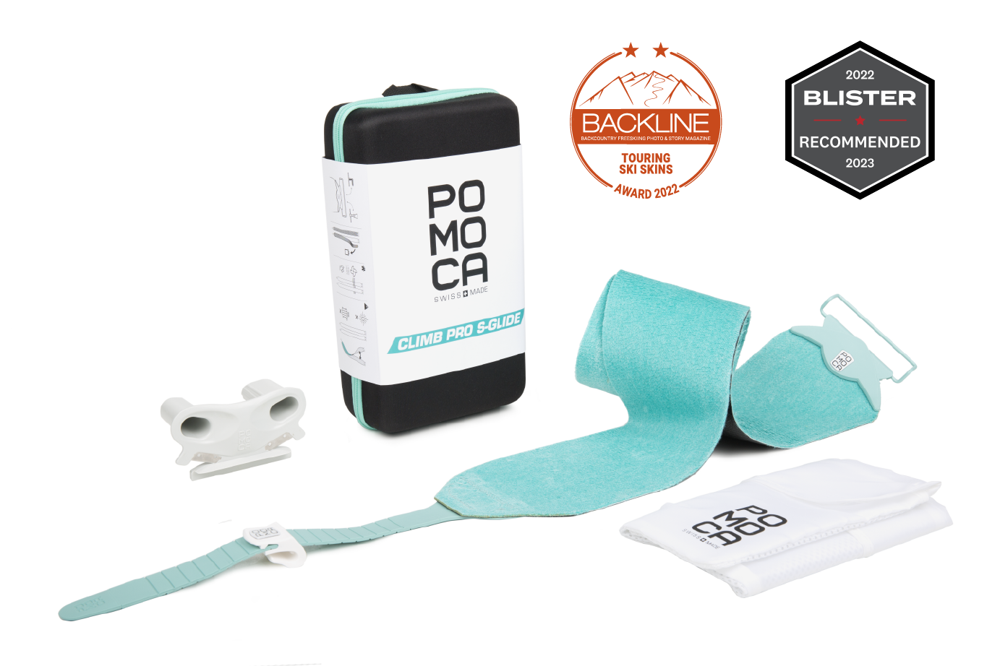

# Rob's 60th Birhtday Present

## Bent Chetlaer 110s

### The Atomic Bent 110 ski was designed by Chris Benchetler and the Atomic Freeski team to rip pow turns, slash windlips, and send any line you can imagine.

---

## Atomic Shift bindings

### The Atomic Shift 13 MN is a tech binding for hiking - then a genuine freeride binding for skiing.

---

## Pomoca Skins

### The Climb Pro S-Glide is the best gliding mix skin ever, the best anti-glopping and the most resistant one. This is the skin for professionals of the mountain for several days' tours.

---

